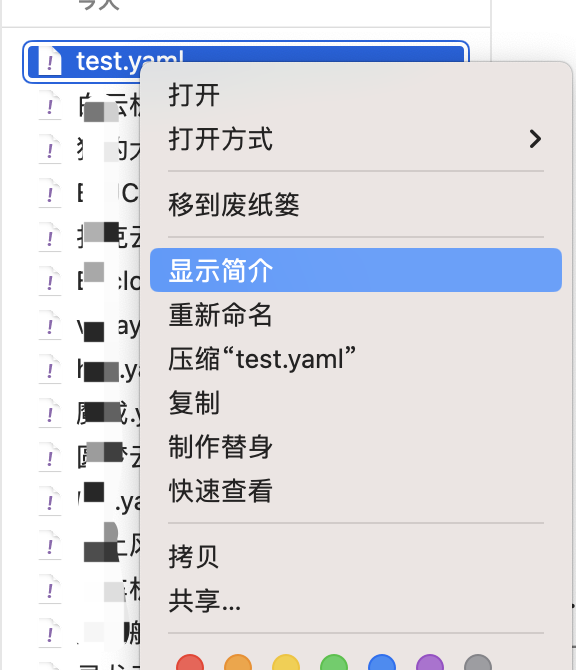

# 基于clash内核的节点筛选器

节点池的节点太多, 而且大部分不能用, 不好看

没关系, 通过这个节点筛选器就能筛选出能用的节点, 并备注节点的地区及ISP

写的一般, 凑合着用吧

# 使用方法

> 使用国外的服务器运行无法过滤掉被墙的节点, 所以只能本地运行

## 准备工作

- nodejs >= 10
- clash(clashMeta 等)

## 克隆仓库 or 下载源码 

### 克隆仓库
```bash
git clone git@github.com:airport-share/clash-node-filter.git
```

### 下载源码


## 安装依赖
安装nodejs http://www.runoob.com/nodejs/nodejs-install-setup.html
### 确保安装了nodejs
终端/powershell打开对应的路径, 输入
```bash
node -v && npm -v
```


再输入以下命令安装依赖
```bash
npm i
```

### 确保能访问到clash的API
浏览器打开 http://127.0.0.1:9090/
> 可能有的端口不一样, 或者开启了验证, 这里需要关闭验证, 并设置为9090
显示内容包含clash即可, 我这里是 clashMeta


> 使用 CFW (clash for windows) 的同学注意
CFW 中的控制端口是随机的
可以通过 右键图标 -> 更多 -> 打开开发者工具

network tab下查看请求的url

将 `src/constants/index.js` 中的 `API_BASE_URL` 替换
```JavaScript
const API_BASE_URL = `http://127.0.0.1:9090`;
```
好像需要登录, 我看看怎么弄


## 获取当前clash配置文件路径

点击 clash图标 -> 配置 -> 打开配置文件夹

找到需要操作的配置文件

### windows
windows用户可以右键对应的配置文件, 点击 `属性`, 应该有一个 文件路径
### mac
mac用户可以右键对应的配置文件, 点击 `显示简介`

`位置` 处右键 `拷贝为路径名称`, 还有下面的 `名称与扩展名`


修改 `config.js` 中的 `configPath`
```javascript
// 配置文件的路径
const configPath = '/Users/xxx/.config/clash/test.yaml';
```

## 运行
将clash设置为全局模式

直接在刚刚打开的终端中执行

```bash
node src/index.js
```

或者

```bash
npm start
```

等待结果


## [可选]获取github token
用于将订阅文件发布到云端


点击创建, 填写表单


勾选 `gist` 就行, 保存


点击复制按钮


找到目录的 `config.js` 文件

```JavaScript
// github token
// 如 const auth = 'xxxxxxxxxxx';
const auth = '';
```

## [可选]配置TG机器人和群组
### 获取TG机器人
通过 [BotFather](https://t.me/BotFather) 创建机器人
创建完成获取token

### 添加通知群组
可以通过将 [nm机器人](https://t.me/nmnmfunbot) 添加到群组
发送 `/id` 获取到当前聊天的id


找到目录的 `config.js` 文件

```JavaScript
// tg群id
const chatIds = ['-1023123123'];
// 配置文件的路径
const configPath = '/Users/xxx/.config/clash/test.yaml';
// 通过tg机器人发送到群里
const telegramBotToken = '6027802759:AAEtRVFibV-uSK9ksjlks9jhqZyfE8nckiQ';
```